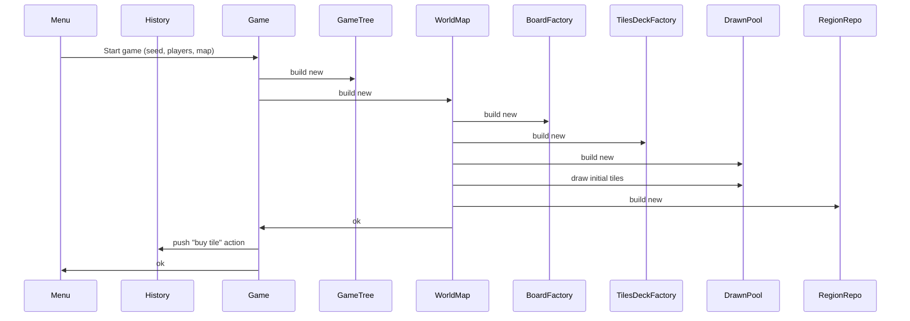
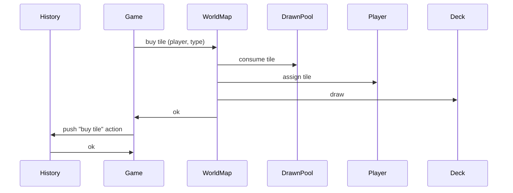

# History

The game's save file is a serialised tree of actions and a link their parent(s).
All the metadata for an action (including the parent reference) is hashed to
maintain referential integrity, and efficiently detect tampering.

Since the RNG has a structured determinism, any point in a game can be simply
and cheaply rehydrated, to validate the parts that the hash doesn't cover.

The intent, though, isn't to discourage tampering or experimentation, just to
highlight that a save file may not be the result of organic gameplay.
Programmatic play and speedruns are encouraged.

## Game-level actions

### Start game

## World map action

### Buy tile

### Place tile

### Buy item

## Region game actions

### Swap tiles

### Use item
